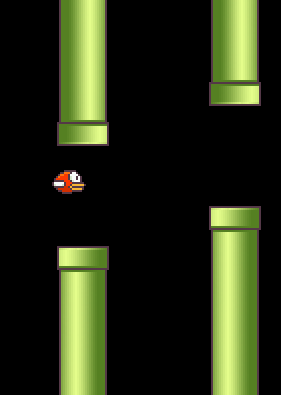

#	FIRST FLAWLESS - IMMORTAL - PERFECT FLAPPY BIRD BOT - How to Train Your Pigeon

I checked my here-included Flawless Flappy net over millions of pipes - ran for 30 hours on a GPU - and it didn't die even once. So I'm concluding that the problem is now solved in full. For the first time in history. Meanwhile, these bots can be really small - even as low as 500KB in size (and lower is certainly possible with grouped convolutions and more refinement) - and fast. Part of the network in this model is not used, so the actual size is even smaller than those 1.3MB.

#	Dependencies
1.	[Install TensorFlow](https://www.tensorflow.org/install/)
2.	`sudo apt-get install graphviz`
3.	`sudo pip install numpy keras scikit-image pygame pydot graphviz` or, maybe, `pip install numpy keras scikit-image pygame pydot graphviz`
5.	`git clone https://github.com/ibmua/flappy.git`

I'll post the solution later.

License: public domain.
